# 🗺️ Code Maps: B2B Outreach Tool

This document provides a visual and conceptual map of the **B2B Outreach Tool** codebase. Use this to understand how different components interact, where data flows, and how the "Brain" of the application operates.

## 🏗️ High-Level Architecture

The application is built on **Streamlit** for the frontend, with a background **Automation Engine** that drives autonomous agents.

```mermaid
flowchart TD
    User(["👤 User"]) <--> UI["🖥️ Streamlit UI (src/app.py)"]
    
    subgraph "Frontend Layer"
        UI --> Pages["Navigation & Pages"]
        Pages --> Dashboard
        Pages --> CampaignMgr["Campaign Manager"]
        Pages --> AgentLab["Agent Lab"]
    end
    
    subgraph "Core System"
        UI --"Trigger"--> AutoEngine["⚙️ Automation Engine"]
        AutoEngine <--> Manager["🤖 Manager Agent"]
        Manager --"Orchestrates"--> Swarm["🐝 Agent Swarm"]
        
        UI --"Read/Write"--> DB[("(🗄️ SQLite Database)")]
        AutoEngine --"Persist work"--> DB
    end
    
    subgraph "External World"
        Swarm --"Requests"--> ProxyMgr["🛡️ Proxy Manager"]
        ProxyMgr <--> Internet(("☁️ Internet"))
        Swarm --"API Calls"--> LLM["🧠 LLM Provider (OpenAI/Anthropic)"]
    end
```

### Key Components

- **`src/app.py`**: The "Main Loop". It initializes the database, config, and renders the Streamlit UI. It handles the "Navigation" sidebar and page switching.
- **`src/automation_engine.py`**: The heartbeat of autonomous missions. It runs in a background thread (or effectively so within the Streamlit lifecycle) to keep agents working even when the user isn't clicking buttons.
- **`src/database.py`**: The central source of truth. All leads, campaigns, and agent logs are stored here.

---

## 🤖 The Agent Swarm (Brain)

The **ManagerAgent** acts as the conductor, delegating tasks to specialized agents based on the mission goal.

### Specialist Agents

| Agent | Role | Key File |
|-------|------|----------|
| **Manager** | Orchestrator & Planner | `src/agents/manager.py` |
| **Researcher** | Web Scraping & Lead Finding | `src/agents/researcher.py` |
| **Copywriter** | Content Generation (Emails, Blogs) | `src/agents/copywriter.py` |
| **SEO Expert** | Audits & Keyword Research | `src/agents/seo_agent.py` |
| **AccountCreator** | Automates Sign-ups | `src/agents/account_creator.py` |
| **Proxy Agent** | Manages IP Rotation | `src/agents/proxy_agent.py` |

---

## 🛡️ Connectivity & Stealth (The Proxy Layer)

How the application connects to the internet without getting blocked.

### "Vibe" Check on Key Files

- **`src/proxy_manager.py`**: The "Bouncer". It keeps a list of good and bad IPs and makes sure agents don't use burnt proxies.
- **`src/agents/base.py`**: The "Common Ancestor". All agents inherit from this. It gives them the ability to "Speak", "Think", and "Remember".
- **`src/workflow.py`**: The "Recipe Book". Defines linear sequences of actions (e.g., "Search -> Enrich -> Email") that can be run repeatedly.

## 💾 Data Flow & Persistence

Where does the data go?

1. **Input**: User uploads CSV or Agent scrapes Web.
2. **Processing**: `pandas` helps clean data; Agents enrich it.
3. **Storage**: `leads.db` (SQLite) stores everything.
4. **Output**: CSV Exports or Dashboard Visualization.

> [!TIP]
> **Debugging**: If data seems missing, check `leads.db` directly or look at `src/database.py` to see if the `commit()` function is being called!
